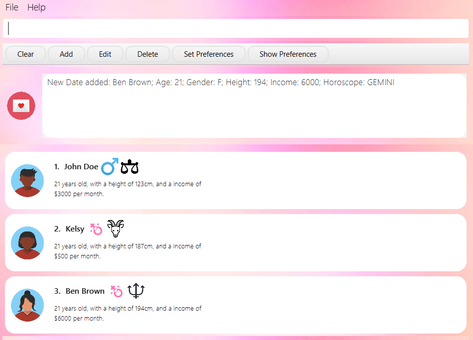
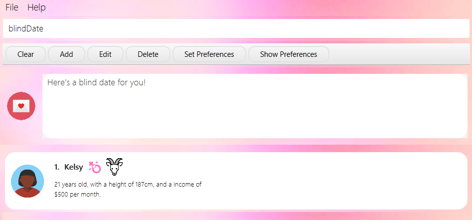
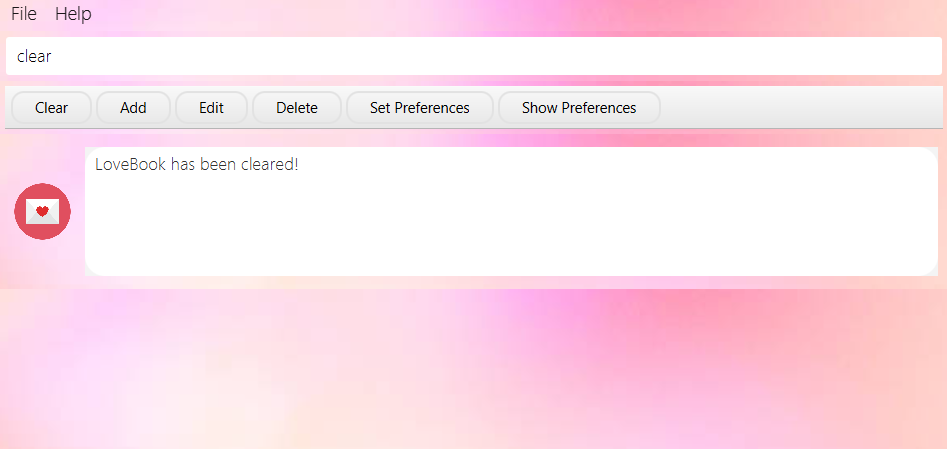
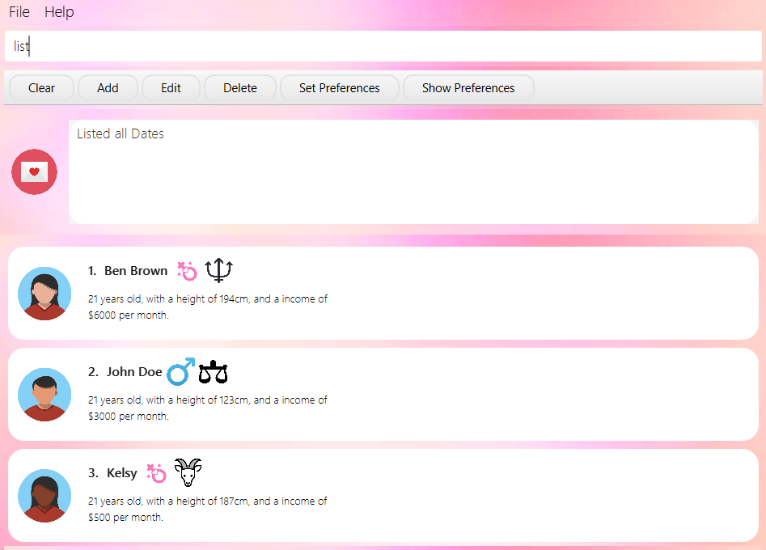
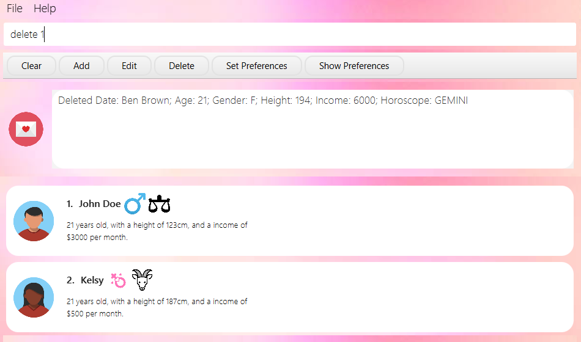
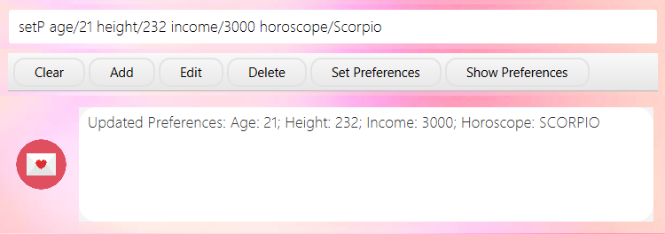

# LoveBook User Guide

LoveBook, is a dating-focused application, revolving around providing users with a convenient
and enjoyable tool to enhance their dating experiences. Featuring user preferences management, date organization,
customizable filtering options and best match algorithms, LoveBook enhances the efficiency and effectiveness of your
online dating journey.

<!-- * Table of Contents -->
<page-nav-print />

--------------------------------------------------------------------------------------------------------------------
## Table of Contents
* [Quick Start](#quick-start)
* [Features](#features)
  * [Add a new Date: `add`](#add-a-new-date-add)
  * [Get a recommended Date: `bestMatch`](#get-a-recommended-date-bestmatch)
  * [Get a blind Date: `blindDate`](#get-a-blind-date-blinddate)
  * [Clear all Dates: `clear`](#clear-all-dates-clear)
  * [Delete a Date: `delete`](#delete-a-date-delete)
  * [Edit a Date: `edit`](#edit-a-date-edit) 
  * [Exit the Programme: `exit`](#exit-the-programme-exit)
  * [Filter by Metric: `filter`](#filter-by-metric-filter)
  * [Find a Date: `find`](#find-a-date-find)
  * [Help: `help`](#help-help)
  * [List all Dates: `list`](#list-all-dates-list)
  * [Set Date Preference: `setP`](#set-date-preference-setp)
  * [Show Date Preference: `showP`](#show-date-preference-showp)
  * [Sort Dates by Metric with Order: `sort`](#sort-dates-by-metric-with-order-sort)
  * [Star a Date: `star`](#star-a-date-star)
  * [Unstar a Date: `unstar`](#unstar-a-date-unstar)
* [FAQ](#faq)
* [Command Summary](#command-summary)
* [Glossary](#glossary)

--------------------------------------------------------------------------------------------------------------------

## **Quick Start**

1. Ensure that you have Java `11` or above installed in your Computer.

2. Download the latest `LoveBook.jar` from [here](https://github.com/AY2324S1-CS2103T-F10-2/tp).

3. Double-click the file to start the app. The window that appears will be similar to the below should appear in a few
   seconds.<br>
   
   *Figure 1: A view of LoveBook at startup*

4. Type the command in the command box and press Enter to execute it. e.g. typing `help` and pressing `Enter` to
   open the help window.<br>
   Some commands you can try:

    * `list` : Lists all dates and their associated details

    * `exit` : Exits the app

5. Refer to the features below for details of each command.

--------------------------------------------------------------------------------------------------------------------

## **Features**

<div markdown="block" class="alert alert-info">

**:information_source: Notes about the command format:**<br>

* Words in `UPPER_CASE` are the parameters to be supplied by the user.<br>
  e.g. in `edit INDEX METRIC/NEW_ARG`, `INDEX`, `NEW_ARG` and `METRIC` are parameters which can be used as
    `edit 2 income/3000`.

* Items in square brackets are optional.<br>
  e.g `age/AGE [horoscope/HOROSCOPE]` can be used as `age/22 horoscope/ARIES` or as `age/22`.

* Parameters can be in any order.<br>
  e.g. if the command specifies `name/NAME age/AGE`, `age/AGE name/NAME` is also acceptable.

* Extraneous parameters for commands that do not take in parameters (such as `help`, `list`, `exit` and `clear`)
  will be ignored.<br> e.g. if the command specifies `help 123`, it will be interpreted as `help`.

* If you are using a PDF version of this document, be careful when copying and pasting commands that span multiple lines
  as space characters surrounding line-breaks may be omitted when copied over to the application.
</div>

<box type="info">

* `NAME` can include letters, numbers and spaces. It must not be left blank.
* `AGE` should be a positive integer between 18 and 150 (inclusive).
* `GENDER` should be either M or F. It is case sensitive.
* `HOROSCOPE` should be a valid zodiac sign. It is case insensitive.
* `INCOME` (per month) should be a positive integer in SGD.
* `HEIGHT` should be a positive integer in cm between 100cm and 250cm (inclusive).

</box>

### Add a new date: `add`

Adds a date to the LoveBook.

Format: `add name/NAME age/AGE gender/GENDER height/HEIGHT horoscope/HOROSCOPE income/INCOME`

<box type="tip" seamless>
    Parameters in the add command can be in any order.
</box>

Example: `add name/Cleon age/22 gender/F height/176 horoscope/Taurus income/3000`


Expected output: `New date added: Cleon; Age: 22; Gender: F; Height: 176; Income: 3000; Horoscope: TAURUS`

Output if error:

```
Invalid command format! 
add: Adds a Date to the LoveBook. Parameters: name/NAME age/AGE gender/GENDER height/HEIGHT income/INCOME horoscope/HOROSCOPE
Example: add name/John Doe age/21 gender/M height/123 income/3000 horoscope/Libra
```

### Get a recommended Date: `bestMatch`

Filters out the most compatible date based on the set preferences.

Format: `bestMatch`


Expected Output: `Here's your best match!`

Output if error: `Initialise list with dates before calling bestMatch`

### Get a blind Date: `blindDate`

Outputs a blind date from the LoveBook.

Format: `blindDate`





Expected Output: `Here's a blind date for you!`

Output if error: `Initialise list with dates before calling blindDates`

### Clear all Dates: `clear`

Clears all dates in the LoveBook.

Format: `clear`




Expected output: `LoveBook has been cleared!`

### List all Dates: `list`

Shows a list of all dates in the LoveBook.

Format: `list`



Expected output: `Listed all Dates`

### Delete a Date: `delete`

Deletes the specified date from the LoveBook.

Format: `delete INDEX`

<box type="tip" seamless>
    The index must be a positive integer, and be within the range of the recorded dates.
    For example, if there are 3 Dates in LoveBook, the indices are 1, 2 and 3.
</box>

Example: `delete 1`



Expected output: `Deleted Date: Ben Brown; Age: 21; Gender: F; Height: 194; Income: 6000; Horoscope: GEMINI`

Output if error :
```
Invalid command format! 
delete: Deletes the Date identified by the index number used in the displayed Date list.
Parameters: INDEX (must be a positive integer)
Example: delete 1
```

### Edit a Date: `edit`

Edits a date in the specified index in the LoveBook.

Format: `edit INDEX [name/NAME] [age/AGE] [gender/GENDER] [height/HEIGHT] [income/INCOME] [horoscope/HOROSCOPE]`

<box type="tip" seamless>
    The index must be a positive integer, and be within the range of the recorded dates.
    For example, if there are 3 Dates in LoveBook, the indices are 1, 2 and 3.
</box>

Parameter constraints:
- Metric is limited to `gender, age, horoscope, name, height, income` only
- New argument replaces the existing argument for that metric
- User can edit up to n number of metrics in one command line, where n refers to the number of metrics available

Examples:

- `edit 3 name/Cleon` (editing 1 metric)
- `edit 3 name/Cleon horoscope/Cancer` (editing 2 metrics)
- `edit 3 horoscope/Cancer name/Cleon` (sequence doesn't matter)


Expected Output: `Edited Date: Cleon; Age: 12; Gender: M; Height: 123; Income: 3000; Horoscope: CANCER`

Output if error:

```
edit: Edits the details of the Date identified by the index number used in the displayed Date list. Existing values will be overwritten by the input values.
Parameters: INDEX (must be a positive integer) [name/NAME] [age/AGE] [gender/GENDER] [height/HEIGHT] [income/INCOME] [horoscope/HOROSCOPE]
Example: edit 1 age/24 gender/M height/180 income/3000 horoscope/SCORPIO 
```

### Exit the Programme: `exit`

Exits the program.

Format: `exit`

Expected output: `Exiting LoveBook...`

### Filter by Metric: `filter`

Filters the dates in the LoveBook by a specific metric.

Format: `filter METRIC/ARG`

* Parameter constraints:
* Filter must be from list of metrics
* Metric is limited to `gender, age, horoscope, name, income, height` only

Example:

- `filter name/Cleon`
- `filter gender/M`
- `filter gender/M name/Cleon`

Expected Output: `Lists the dates with the metric specified`

Output if error: `No dates found!`

### Find a Date: `find`

Finds a date in the LoveBook by a specific name(s)

Format: `find NAME [MORE_NAMES]`

Parameter constraints:

- Name should be a non non-empty string.
- More names can be added to the command line, and the search will be conducted for all names provided

Example:

- `find Cleon`
- `find Cleon John`

Expected Output: `Lists the dates with the name(s) specified`

Output if error: `0 dates listed!`

### Help: `help`

Shows a modal to bring user to the LoveBook User Guide.

Format: `help`


Expected output: `Opened help window.`

### Set Date Preference: `setP`

Sets the user's preferences for the matching algorithm.

<box type="info" seamless>

* Note: At least one field to edit must be provided.
* The relevant fields are 
  * `age/AGE`
  * `height/HEIGHT`
  * `income/INCOME`
  * `horoscope/HOROSCOPE`

</box>


Format: `setP [age/AGE] [height/HEIGHT] [income/INCOME] [horoscope/HOROSCOPE]`

Example: `setP age/22 height/180 income/2000 horoscope/TAURUS`



Expected output:
```
Updated Preferences: Age: 22; Height: 180; Income: 2000; Horoscope: TAURUS
```

Output if error:
```
At least one field to edit must be provided.
Please try the following command format: setP: Sets Date Preference. Parameters: age/AGE height/HEIGHT income/INCOME horoscope/HOROSCOPE.
Example: setP age/21 height/180 income/3000 horoscope/Scorpio
```

### Show Date Preference: `showP`

Shows the User's Date Preference. This can be edited using the [`setP`](#star-a-date-star) command. 

Format: `showP`

Expected output: `Here are your preferences: Age: 22; Height: 180; Income: 2000; Horoscope: TAURUS`

### Sort Dates by Metric with Order: `sort`

Sorts the dates in the LoveBook by a specific metric.

Format: `sort METRIC/ORDER`

Parameter constraints:

<box type="info" seamless>

**Caution:**

* The relevant metrics are
  * `name/ORDER`
  * `age/ORDER`
  * `height/ORDER`
  * `income/ORDER`
  * `horoscope/ORDER`

* Order is limited to `increasing` or `decreasing` only

</box>

Example:

- `sort name/increasing`
- `sort horoscope/decreasing`

Expected Output: `Lists the dates in the order specified`

Output if error:

```
Invalid command format! 
sort: Sorts all dates in LoveBook alphabetically or numerically.
Parameters: name/ OR age  OR height/ OR income/ OR horoscope/ AND increasing OR decreasing
Example: sort name/increasing
```

### Star a Date: `star`

Stars a date in the LoveBook.

Format: `star INDEX`

Example: `star 1`

Expected output: `Starred Date: John Doe; Age: 21; Gender: F; Height: 245; Income: 3000; Horoscope: LIBRA`

Output if error:

```
Invalid command format!
star: stars the Date identified by the index number used in the displayed Date list.
Parameters: INDEX (must be a positive integer)
Example: star 1
```

<box type="info" seamless>

* If Date is already starred, it will display the output `Date has already been starred`

</box>

### Unstar a Date: `unstar`

Unstars a date in the LoveBook.

Format: `unstar INDEX`

Example: `unstar 1`

Expected output: `Unstarred Date: John Doe; Age: 21; Gender: M; Height: 123; Income: 3000; Horoscope: LIBRA`

Output if error:
`The date index provided is invalid`

<box type="info" seamless>

* If Date is already unstarred, it will display the output `Date has already been unstarred`

</box>

--------------------------------------------------------------------------------------------------------------------

## **FAQ**

**Q**: How do I transfer my data to another Computer?<br>
**A**: Install the app in the other computer and overwrite the empty data file with the file that
contains the data of your previous LoveBook home folder.

**Q**: Is my data stored in the cloud? Will I be open to data breaches?<br>
**A**: No, all your data is stored locally, no need to fear a potential data hack.

**Q**: Do I have to save before exiting the application for my data to safely backed up on my computer? <br>
**A**: All your data is saved on your computer as soon as you enter in the command. There is no need to manually save
your data. In the event of a power outage, all your data will be safe.

**Q**: Where do I go if I have issues with LoveBook? <br>
**A**: You may leave your issues [here](https://github.com/AY2324S1-CS2103T-F10-2/tp/issues).

**Q**: What happens if I enter invalid data into the stored data file? <br>
**A**: LoveBook will clear all the existing data and reset to as it was when you installed it. It is highly discouraged
to manually edit the data file.

--------------------------------------------------------------------------------------------------------------------

## **Command Summary**

| Action                                                                   | Format                                                                                                    | Examples                                                               |
|--------------------------------------------------------------------------|-----------------------------------------------------------------------------------------------------------|------------------------------------------------------------------------|
| [Add a new Date](#add-a-new-date-add)                                    | `add name/NAME age/AGE gender/GENDER height/HEIGHT horoscope/HOROSCOPE income/INCOME`                     | `add name/John age/25 gender/M height/175 horoscope/Aries income/5000` |
| [Get a recommended Date](#get-a-recommended-date-bestmatch)              | `bestMatch`                                                                                               | `bestMatch`                                                            |
| [Get a blind Date](#get-a-blind-date-blinddate)                          | `blindDate`                                                                                               | `blindDate`                                                            |
| [Clear all Dates](#clear-all-dates-clear)                                | `clear`                                                                                                   | `clear`                                                                |
| [Delete a Date](#delete-a-date-delete)                                   | `delete INDEX`                                                                                            | `delete 2`                                                             |
| [Edit a Date](#edit-a-date-edit)                                         | `edit INDEX [name/NAME] [age/AGE] [gender/GENDER] [height/HEIGHT] [income/INCOME] [horoscope/HOROSCOPE]`  |  `edit 3 name/Cleon`                                                   |
| [Exit the Programme](#exit-the-programme-exit)                           | `exit`                                                                                                    | `exit`                                                                 |
| [Filter by Metric](#filter-by-metric-filter)                             | `filter METRIC/ARG`                                                                                       | `filter name/Cleon`                                                    |
| [Find a Date](#find-a-date-find)                                         | `find NAME [MORE_NAMES]`                                                                                  | `find Cleon`                                                           |
| [Help](#help-help)                                                       | `help`                                                                                                    | `help`                                                                 |
| [List all Dates](#list-all-dates-list)                                   | `list`                                                                                                    | `list`                                                                 |
| [Set Date Preference](#set-date-preference-setp)                         | `setP [age/AGE] [height/HEIGHT] [income/INCOME] [horoscope/HOROSCOPE]`                                    | `setP age/22 height/180 income/2000 horoscope/TAURUS`                  |
| [Show Date Preference](#show-date-preference-showp)                      | `showP`                                                                                                   | `showP`                                                                |
| [Sort Dates by Metric with Order](#sort-dates-by-metric-with-order-sort) | `sort METRIC/ORDER`                                                                                       | `sort name/increasing`                                                 |
| [Star a Date](#star-a-date-star)                                         | `star INDEX`                                                                                              | `star 1`                                                               |
| [Unstar a Date](#unstar-a-date-unstar)                                   | `unstar INDEX`                                                                                            | `unstar 1`                                                             |

--------------------------------------------------------------------------------------------------------------------

## **Glossary**

* Date: The date that that User will key in to LoveBook.
* Mainstream OS: Windows, Linux, Unix, OS-X.
* GUI: Graphical User Interface
* CLI: Command Line Interface
