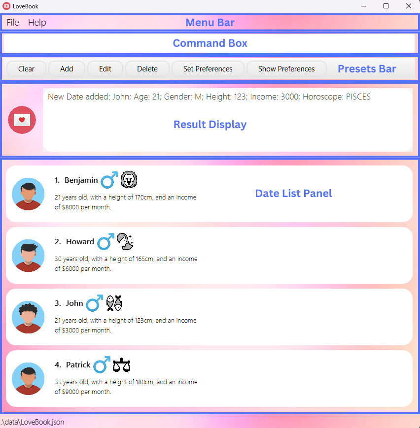
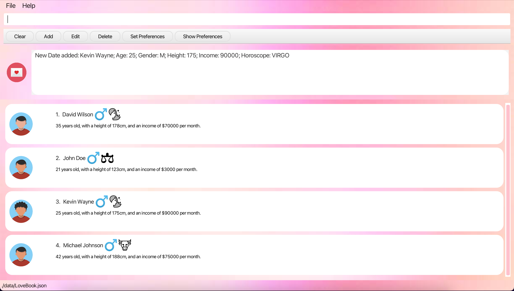
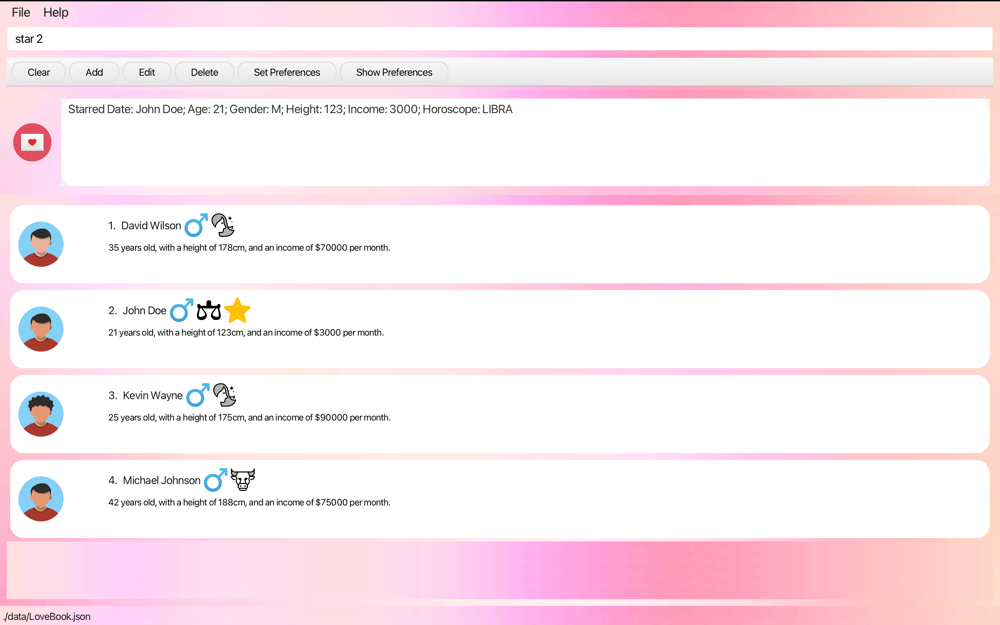
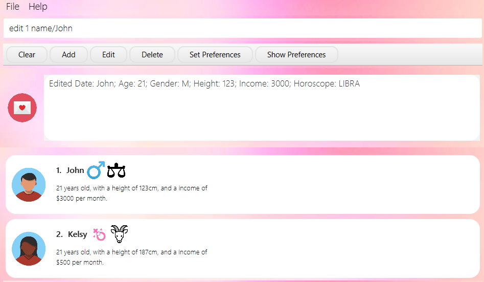
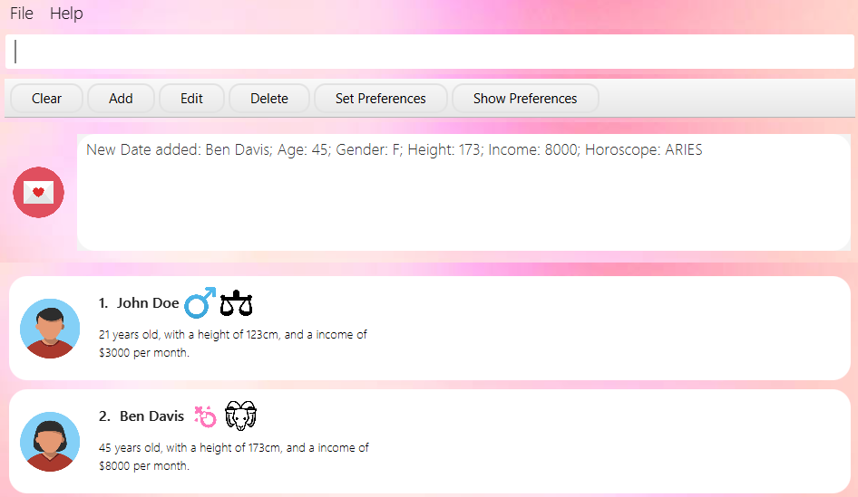

# LoveBook User Guide

LoveBook, is a **dating-focused** application, revolving around providing **serial daters** with a **convenient**
and **enjoyable** tool to enhance their dating experiences. Featuring **user preferences management**, **date organization**,
**customizable filtering options** and **best match algorithms**, LoveBook enhances the **efficiency** and **effectiveness** of your
online dating journey.

<!-- * Table of Contents -->
<page-nav-print />

## **Glossary**

| Term                      | Definition                                                                                                       |
|---------------------------|------------------------------------------------------------------------------------------------------------------|
| Date                      | A person that the user is interested in and is currently seeing.                                                 |
| Metric                    | A certain characteristic of a date. (e.g. Gender, Height)                                                        |
| Command                   | Text that the user types into the application to perform an action.                                              |
| Parameter                 | A value that the user provides to the application when executing a command. (e.g. in `gender/M` M is a parameter) |
| GUI                       | Graphical User Interface                                                                                         |
| CLI                       | Command Line Interface                                                                                           |
| Mainstream OS             | Windows, Linux, Unix, OS-X                                                                                       |
| <box type="tip">tip</box> | Suggestions on how to use the commands as well as address potential confusions when using these commands.        |
| <box type="important">important</box>| Inform you of some unexpected consequences that may occur when you use the commands.                |


### **Common Symbols**

As you navigate through the application, you may come across certain symbols depicting your date's gender and horoscope.
Here's a quick guide to help you understand what they mean.

#### Gender Symbols
| Gender  | Symbol                                                                                                                                 |
|---------|----------------------------------------------------------------------------------------------------------------------------------------|
| Male    |    |
| Female  |  |

#### Horoscope Symbols
| Horoscope   | Symbol                                                                                                                                         | Birthday Range            |
|-------------|------------------------------------------------------------------------------------------------------------------------------------------------|---------------------------|
| Aries       |        | March 21 - April 19       |
| Taurus      |       | April 20 - May 20         |
| Gemini      |       | May 21 - June 20          |
| Cancer      |       | June 21 - July 22         |
| Leo         |          | July 23 - August 22       |
| Virgo       |        | August 23 - September 22  |
| Libra       |        | September 23 - October 22 |
| Scorpio     |      | October 23 - November 21  |
| Sagittarius |  | November 22 - December 21 |
| Capricorn   |    | December 22 - January 19  |
| Aquarius    |     | January 20 - February 18  |
| Pisces      |       | February 19 - March 20    |
--------------------------------------------------------------------------------------------------------------------
## **Quick Start**

### **Download and Installation**

1. Ensure that you have Java `11` or above installed in your Computer.

2. Download the latest `LoveBook.jar` from [here](https://github.com/AY2324S1-CS2103T-F10-2/tp).

3. Double-click the file to start the app. The window that appears will be similar to the below should appear in a few
   seconds. Note that in this case, we have sample data.<br>
   
   *Figure 1: A view of LoveBook at startup*

4. Type the command in the command box and press Enter to execute it. e.g. typing `help` and pressing `Enter` to
   open the help window.<br>
   Some commands you can try:

    * `list` : Lists all dates and their associated details

    * `exit` : Exits the app

5. Refer to the features below for details of each command.

### **Navigating the GUI**

If you're new to this program, the initial screen might appear a bit daunting. Don't fret; let's explore the various elements of the LoveBook interface together.
We suggest enlarging the program window for a clearer perspective, allowing you to view more content.

Here's the detailed breakdown of the LoveBook screen: <br>


- **Menu Bar** - This is where you can find the `File` and `Help` options. Click on `File` to access the `Exit` option. Click on `Help` to access the `Help` option.
- **Command Box** - This is where you type in your commands. Press `Enter` to execute the command.
- **Presets Bar** - This is where you can find the preset commands. Click on a preset command to populate your command box.
- **Result Display** - This is where the results of your commands are displayed.
- **Date List Panel** - This is where the list of dates are displayed. The list is scrollable, and you can scroll up and down to view the entire list.

### **LoveBook Tutorial: Getting started**
Now that you are familiar with the layout of LoveBook, we recommend you try the following steps to develop a feel for the core features of LoveBook.

#### 1. Adding a date
So you've just started dating. How do you begin using this app?

Let's say you went out on a date with John. Throughout your date you find out key things about him, he's 123cm tall, earns 3k a month, his horoscope is Libra.
Here you can add John to LoveBook using the add command:

In the command box, enter `add name/John Doe age/21 gender/M height/123 income/3000 horoscope/Libra` and press the `enter` key.
This will add John to LoveBook.

Let's imagine you've added a couple of dates to the LoveBook already. It should look something like this now:


#### 2. Starring a date
With so many dates you might want to start keeping tabs on dates that are perhaps more exceptional. Fret not, star dates as you go along
in your journey. Here you can star John for instance, using the star command:
Enter `star 2`.
This will star John.


#### 3. Filtering dates
With so many dates, you might want to start filtering down to the metrics that matter. Perhaps you seek someone younger, simply filter for
a specific age. Here you can filter for an age of 21 for instance, using the filter command:
Enter `filter age/21`.
This will filter for John.


#### 4. Set Preferences
Well, maybe you are indecisive as a serial dater, and you want a third party opinion. Fret not, simply begin by keying in your preferences using the
setPreferences command:
Enter `setP age/22 height/130 income/3200 horoscope/Libra`
This will set your preferences like so:


#### 5. Best Match
And here it is, to get the match of your dreams, simply use the bestMatch command:
Enter `bestMatch`


### Congrats! You have completed the tutorial!
The tutorial shows you what a typical workflow might look like on LoveBook. Do continue to peruse the commands section which contains
other commands that, while not worth covering in a quick start tutorial, are certainly important to using LoveBook as a whole.
Here's to you embarking on your LoveBook journey!


--------------------------------------------------------------------------------------------------------------------

## **Features**

<div markdown="block" class="alert alert-info">

**:information_source: Notes about the command format:**<br>

* Words in `UPPER_CASE` are the parameters to be supplied by the user.<br>
  e.g. in `edit INDEX METRIC/NEW_ARG`, `INDEX`, `NEW_ARG` and `METRIC` are parameters which can be used as
    `edit 2 income/3000`.

* Items in square brackets are optional.<br>
  e.g `age/AGE [horoscope/HOROSCOPE]` can be used as `age/22 horoscope/ARIES` or as `age/22`.

* Parameters can be in any order.<br>
  e.g. if the command specifies `name/NAME age/AGE`, `age/AGE name/NAME` is also acceptable.

* For commands that accept a positive integer, the integer cannot be preceded with a leading zero.
  For instance, `star 9` is valid, but `star 09` is invalid

* Extraneous parameters for commands that do not take in parameters (such as `help`, `list`, `exit` and `clear`)
  will be ignored.<br> e.g. if the command specifies `help 123`, it will be interpreted as `help`.

* If you are using a PDF version of this document, be careful when copying and pasting commands that span multiple lines
  as space characters surrounding line-breaks may be omitted when copied over to the application.
</div>

 ### Prefix Table
| Metric | Prefix | Constraints                                                                             |
|--------|--------|-----------------------------------------------------------------------------------------|
| Name | `name/` | Name can only contain letters, numbers and spaces. It must not be left blank.           |
| Age | `age/` | Age should be a positive integer between 18 and 150 (inclusive).                        |
| Gender | `gender/` | Gender should be either M or F. It is case sensitive.                                   |
| Height | `height/` | Height should be a positive integer in cm between 100cm and 250cm (inclusive).          |
| Income | `income/` | Income (per month) should be a positive integer in SGD less than or equal to a million. |
| Horoscope | `horoscope/` | Horoscope should be a valid zodiac sign. It is case insensitive.                        |

--------------------------------------------------------------------------------------------------------------------
### **Managing Dates**
 
#### **Adding a new date: `add`**

Adds a date to the LoveBook.

Format: `add name/NAME age/AGE gender/GENDER height/HEIGHT horoscope/HOROSCOPE income/INCOME`

Example: `add name/John Doe age/21 gender/M height/123 income/3000 horoscope/Libra`


Expected output: `New date added: John Doe; Age: 21; Gender: M; Height: 123; Income: 3000; Horoscope: LIBRA`

#### **Editing a date: `edit`**

Edits a date in the specified index in the LoveBook.

Format: `edit INDEX [name/NAME] [age/AGE] [gender/GENDER] [height/HEIGHT] [income/INCOME] [horoscope/HOROSCOPE]`

<box type="tip" seamless>
    The index must be a positive integer, and be within the range of the recorded dates.
    For example, if there are 3 Dates in LoveBook, the indices are 1, 2 and 3.
</box>

Parameter constraints:
- Metric is limited to `gender, age, horoscope, name, height, income` only
- New argument replaces the existing argument for that metric
- User can edit up to n number of metrics in one command line, where n refers to the number of metrics available

Examples:

- `edit 1 name/John` (editing 1 metric)
- `edit 1 name/John horoscope/Cancer` (editing 2 metrics)
- `edit 1 horoscope/Cancer name/John` (sequence doesn't matter)



Expected Output: `Edited Date: John; Age: 21; Gender: M; Height: 123; Income: 3000; Horoscope: LIBRA`

#### **Deleting a date: `delete`**

Deletes the specified date from the LoveBook.

Format: `delete INDEX`

<box type="tip" seamless>
    The index must be a positive integer, and be within the range of the recorded dates.
    For example, if there are 3 Dates in LoveBook, the indices are 1, 2 and 3.
</box>

Example: `delete 1`


Expected output: `Deleted Date: Ben Brown; Age: 21; Gender: F; Height: 194; Income: 6000; Horoscope: GEMINI`

#### **Listing all dates: `list`**

Shows a list of all dates in the LoveBook.

Format: `list`


Expected output: `Listed all Dates`

#### **Clearing all dates: `clear`**

Clears all dates in the LoveBook.

Format: `clear`


Expected output: `LoveBook has been cleared!`

#### **Starring a date: `star`**

Stars a date in the LoveBook.

Format: `star INDEX`

Example: `star 1`

Expected output: `Starred Date: John Doe; Age: 21; Gender: F; Height: 245; Income: 3000; Horoscope: LIBRA`

<box type="info" seamless>

</box>

#### **Unstarring a date: `unstar`**

Unstars a date in the LoveBook.

Format: `unstar INDEX`

Example: `unstar 1`

Expected output: `Unstarred Date: John Doe; Age: 21; Gender: M; Height: 123; Income: 3000; Horoscope: LIBRA`

### **Sorting, Searching for dates**

#### **Finding a date: `find`**

Finds a date in the LoveBook by a specific name(s)

Format: `find NAME [MORE_NAMES]`

<box type="tip">
Parameter constraints:
- Name should be a non-empty string.
- More names can be added to the command line, and the search will be conducted for all names provided
</box>

Example:

- `find Cleon`
- `find Cleon John`

Expected Output: `Lists the dates with the name(s) specified`

#### **Filtering dates by a certain metric: `filter`**

Filters the dates in the LoveBook by a specific metric.

Format: `filter METRIC/ARG`

<box type="tip">
Parameter constraints:
- Filter must be from list of metrics
- Metric is limited to `gender, age, name, height` only
- Arg can only be one keyword
</box>

<box type="important">
- Unlike the find commmand, you cannot use filter to filter for more than a single name, like so `filter name/kevin name/wayne`
</box>

Example:
- `filter name/Cleon`
- `filter gender/M`
- `filter gender/M name/Cleon`

Expected Output: `Lists the dates with the metric specified`

#### **Sorting dates by a certain metric: `sort`**

Sorts the dates in the LoveBook by a specific metric.

Format: `sort METRIC/ORDER`

<box type="tip">
Parameter constraints:
The relevant metrics are
- `name/ORDER`
- `age/ORDER`
- `height/ORDER`
- `income/ORDER`
- `horoscope/ORDER`

Order is limited to `increasing` or `decreasing` only
</box>

<box type="important">
When sorting dates by a field where both have an equal value, say Kevin and Wayne are sorted by income and both have
an income of 2000, applying commands such as edit or star, can affect the stability of the sort. However, the overall
sorting order by value is preserved.
</box>

Example:

- `sort name/increasing`
- `sort horoscope/decreasing`

Expected Output: `Lists the dates in the order specified`

### **Managing Preferences and Getting Matches**

<box type="tips">
By default, Date Preference is set to:
AGE: 21
HEIGHT: 170
INCOME: 10000
HOROSCOPE: ARIES

If you wish to change your Date Preference, please use the [`setP`](#setting-your-date-preferences-setp) command.
The [`bestMatch`](#getting-a-recommended-date-bestmatch) command will use the Date Preference set by the user.
</box>

#### **Showing your date preferences: `showP`**

Shows the User's Date Preference. This can be edited using the [`setP`](#setting-your-date-preferences-setp) command.

Format: `showP`

Expected output: `Here are your preferences: Age: 22; Height: 180; Income: 2000; Horoscope: TAURUS`

#### **Setting your date preferences: `setP`**

Sets the user's preferences for the matching algorithm.

<box type="tips">
Note: At least one field to edit must be provided.
The user's preferences will be used in the [`bestMatch`](#getting-a-recommended-date-bestmatch) command.
Gender is not taken into account here

The relevant fields are
`age/AGE`
`height/HEIGHT`
`income/INCOME`
`horoscope/HOROSCOPE`
</box>


Format: `setP [age/AGE] [height/HEIGHT] [income/INCOME] [horoscope/HOROSCOPE]`

Example: `setP age/22 height/180 income/2000 horoscope/TAURUS`


Expected output:
```
Updated Preferences: Age: 22; Height: 180; Income: 2000; Horoscope: TAURUS
```

#### **Getting a recommended date: `bestMatch`**

Filters out the most compatible date based on the set preferences.

Format: `bestMatch`




Expected Output: `Here's your best match!`

#### **Getting a blind date: `blindDate`**

Outputs a blind date from the LoveBook.

Format: `blindDate`


Expected Output: `Here's a blind date for you!`

### **Other Commands**

#### **Exiting the application: `exit`**

Exits the program.

Format: `exit`

Expected output: `Exiting LoveBook...`

#### **Getting help: `help`**

Shows a window to bring user to the LoveBook User Guide.

Format: `help`


Expected output: `Opened help window.`

--------------------------------------------------------------------------------------------------------------------

## **FAQ**

**Q**: How do I transfer my data to another Computer?<br>
**A**: Install the app in the other computer and overwrite the empty data file with the file that
contains the data of your previous LoveBook home folder.

**Q**: Is my data stored in the cloud? Will I be open to data breaches?<br>
**A**: No, all your data is stored locally, no need to fear a potential data hack.

**Q**: Do I have to save before exiting the application for my data to safely backed up on my computer? <br>
**A**: All your data is saved on your computer as soon as you enter in the command. There is no need to manually save
your data. In the event of a power outage, all your data will be safe.

**Q**: Where do I go if I have issues with LoveBook? <br>
**A**: You may leave your issues [here](https://github.com/AY2324S1-CS2103T-F10-2/tp/issues).

**Q**: What happens if I enter invalid data into the stored data file? <br>
**A**: LoveBook will clear all the existing data and reset to as it was when you installed it. It is highly discouraged
to manually edit the data file.

**Q**: How do I change my date's avatar? <br>
**A**: Currently, the avatars are randomly selected from a pool of 9 avatars. We are working on a feature to allow users
to choose their own avatars.

--------------------------------------------------------------------------------------------------------------------

## **Command Summary**

| Action                                                                            | Format                                                                                                    | Examples                                                               |
|-----------------------------------------------------------------------------------|-----------------------------------------------------------------------------------------------------------|------------------------------------------------------------------------|
| [Adding a new date](#adding-a-new-date-add)                                       | `add name/NAME age/AGE gender/GENDER height/HEIGHT horoscope/HOROSCOPE income/INCOME`                     | `add name/John age/25 gender/M height/175 horoscope/Aries income/5000` |
| [Getting a recommended date](#getting-a-recommended-date-bestmatch)               | `bestMatch`                                                                                               | `bestMatch`                                                            |
| [Getting a blind date](#getting-a-blind-date-blinddate)                           | `blindDate`                                                                                               | `blindDate`                                                            |
| [Clearing all dates](#clearing-all-dates-clear)                                   | `clear`                                                                                                   | `clear`                                                                |
| [Deleting a date](#deleting-a-date-delete)                                        | `delete INDEX`                                                                                            | `delete 2`                                                             |
| [Editing a date](#editing-a-date-edit)                                            | `edit INDEX [name/NAME] [age/AGE] [gender/GENDER] [height/HEIGHT] [income/INCOME] [horoscope/HOROSCOPE]`  |  `edit 3 name/Cleon`                                                   |
| [Exiting the application](#exiting-the-application-exit)                          | `exit`                                                                                                    | `exit`                                                                 |
| [Filtering dates by a certain metric](#filtering-dates-by-a-certain-metric-filter) | `filter METRIC/ARG`                                                                                       | `filter name/Cleon`                                                    |
| [Finding a date](#finding-a-date-find)                                            | `find NAME [MORE_NAMES]`                                                                                  | `find Cleon`                                                           |
| [Help](#getting-help-help)                                                        | `help`                                                                                                    | `help`                                                                 |
| [Listing all dates](#listing-all-dates-list)                                      | `list`                                                                                                    | `list`                                                                 |
| [Setting date preferences](#setting-your-date-preferences-setp)                   | `setP [age/AGE] [height/HEIGHT] [income/INCOME] [horoscope/HOROSCOPE]`                                    | `setP age/22 height/180 income/2000 horoscope/TAURUS`                  |
| [Showing date preferences](#showing-your-date-preferences-showp)                  | `showP`                                                                                                   | `showP`                                                                |
| [Sorting dates by a certain metric](#sorting-dates-by-a-certain-metric-sort)      | `sort METRIC/ORDER`                                                                                       | `sort name/increasing`                                                 |
| [Starring a date](#starring-a-date-star)                                          | `star INDEX`                                                                                              | `star 1`                                                               |
| [Unstarring a date](#unstarring-a-date-unstar)                                    | `unstar INDEX`                                                                                            | `unstar 1`                                                             |

--------------------------------------------------------------------------------------------------------------------

